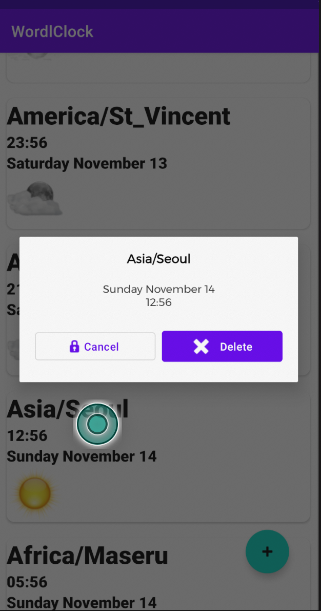

# 🌍 World Clock

<p align="center">
  <a href="https://opensource.org/licenses/Apache-2.0">
    
  </a>
  <a href="https://android-arsenal.com/api?level=24">
    
  </a>
  <a href="https://kotlinlang.org">
    
  </a>
  <a href="https://developer.android.com/jetpack/compose">
    
  </a>
</p>

<p align="center">
  <i>A modern, elegant world clock application built with Jetpack Compose and Clean Architecture principles.</i>
</p>

<p align="center">
  
</p>

## ✨ Features

- � **Real-time Clocks**: Beautiful analog and digital clocks with smooth animations
- 🌏 **Multiple Time Zones**: Track time across different cities and time zones worldwide
- 📱 **Android Widgets**: Home screen widgets with swipe navigation between cities
- 🎨 **Modern UI**: Built with Jetpack Compose and Material 3 design
- 🔄 **Live Updates**: Real-time synchronization with second-by-second accuracy
- 💾 **Persistent Storage**: Your selected time zones are saved and restored
- 🎯 **Clean Architecture**: Maintainable, testable, and scalable codebase

## 📱 Screenshots

<p align="center">
  
  
  
</p>

## 🏗️ Architecture

This app follows **Clean Architecture** principles with **MVVM** pattern, ensuring separation of concerns and maintainability.

### Architecture Layers

```
├── � Presentation Layer (UI)
│   ├── Jetpack Compose UI
│   ├── ViewModels
│   ├── Navigation
│   └── Themes
├── 🎯 Domain Layer (Business Logic)
│   ├── Use Cases
│   ├── Repository Interfaces
│   └── Entities
└── 💾 Data Layer (Data Sources)
    ├── Repository Implementations
    ├── Room Database
    ├── DAOs
    └── Entities
```

### Key Architectural Patterns

- **MVVM (Model-View-ViewModel)**: Separates UI logic from business logic
- **Repository Pattern**: Abstracts data sources and provides a clean API
- **Use Case Pattern**: Encapsulates business logic in reusable components
- **Dependency Injection**: Uses Hilt for clean dependency management

## 🛠️ Tech Stack

### **Core Technologies**
- **Language**: [Kotlin](https://kotlinlang.org/) - 100% Kotlin codebase
- **UI Framework**: [Jetpack Compose](https://developer.android.com/jetpack/compose) - Modern declarative UI
- **Architecture**: Clean Architecture + MVVM pattern

### **Jetpack Components**
- **Compose**: Modern UI toolkit for native Android apps
- **Navigation**: Type-safe navigation for Compose
- **ViewModel**: Lifecycle-aware data holder
- **Room**: SQLite object mapping library
- **Hilt**: Dependency injection framework

### **Reactive Programming**
- **Kotlin Coroutines**: Asynchronous programming
- **Flow**: Reactive streams for real-time updates
- **StateFlow**: State management with lifecycle awareness

### **UI & Design**
- **Material 3**: Latest Material Design components
- **Custom Animations**: Smooth flip animations and transitions
- **Android Widgets**: Home screen widgets with navigation

### **Database**
- **Room Persistence Library**: Local database with type-safe queries
- **SQLite**: Underlying database engine
- **Flow Integration**: Reactive database queries

## 📥 Download

Visit the [Releases Page](https://github.com/spkdroid/WorldClock/releases/) to download the latest APK.

## 🚀 Getting Started

### Prerequisites
- Android Studio Iguana | 2023.2.1 or newer
- JDK 11 or higher
- Android SDK 34
- Minimum Android API 24 (Android 7.0)

### Building the Project

1. **Clone the repository**
   ```bash
   git clone https://github.com/spkdroid/WorldClock.git
   cd WorldClock
   ```

2. **Open in Android Studio**
   - Open Android Studio
   - Select "Open an existing project"
   - Navigate to the cloned directory

3. **Build and Run**
   ```bash
   ./gradlew assembleDebug
   ./gradlew installDebug
   ```

### Project Structure

```
app/                          # Android application module
├── src/main/java/
│   ├── presentation/         # UI layer (Compose, ViewModels, Navigation)
│   ├── widget/              # Android widget implementation
│   └── MainActivity.kt      # Main entry point
domain/                      # Domain layer module
├── src/main/java/
│   ├── usecase/            # Business logic use cases
│   ├── repository/         # Repository interfaces
│   └── di/                 # Dependency injection modules
model/                       # Data layer module
├── src/main/java/
│   ├── entity/             # Data entities
│   └── database/           # Room database and DAOs
```

## 🧪 Testing

The project includes comprehensive testing at multiple layers:

- **Unit Tests**: Domain layer logic testing
- **Integration Tests**: Repository and database testing
- **UI Tests**: Compose UI testing

Run tests with:
```bash
./gradlew test
./gradlew connectedAndroidTest
```

## 🤝 Contributing

Contributions are welcome! Please feel free to submit a Pull Request. For major changes, please open an issue first to discuss what you would like to change.

### Development Guidelines

1. Follow [Kotlin coding conventions](https://kotlinlang.org/docs/coding-conventions.html)
2. Write comprehensive documentation for new features
3. Ensure all tests pass before submitting PR
4. Follow Clean Architecture principles
5. Use meaningful commit messages

## � License

```
Copyright (C) 2025 Ramkumar Velmurugan

Licensed under the Apache License, Version 2.0 (the "License");
you may not use this file except in compliance with the License.
You may obtain a copy of the License at

    http://www.apache.org/licenses/LICENSE-2.0

Unless required by applicable law or agreed to in writing, software
distributed under the License is distributed on an "AS IS" BASIS,
WITHOUT WARRANTIES OR CONDITIONS OF ANY KIND, either express or implied.
See the License for the specific language governing permissions and
limitations under the License.
```

---

<p align="center">
  <i>Built with ❤️ using Jetpack Compose</i>
</p>
